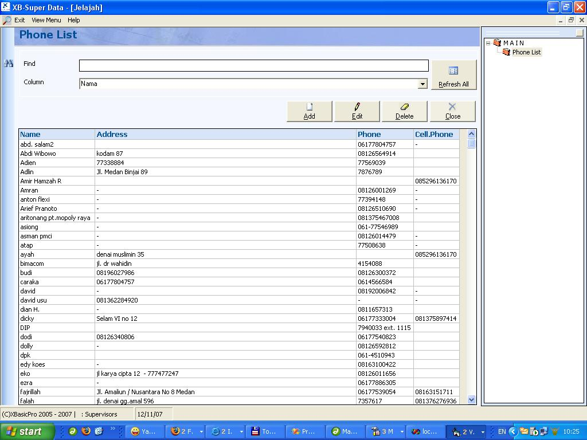



## Flexible Phoone Book

### Description

Flexible Phone Book can Save any phone &amp; address list with ActiveX.OCX and xml technology. You can just modify,add or delete xml and field name whithout modify the source code.
 
### More Info
 

             |
---                |---
**Submitted On**   |2007-11-12 10:21:16
**By**             |[hartoto](https://github.com/Planet-Source-Code/PSCIndex/blob/master/ByAuthor/hartoto.md)
**Level**          |Advanced
**User Rating**    |3.7 (11 globes from 3 users)
**Compatibility**  |VB 6\.0
**Category**       |[Databases/ Data Access/ DAO/ ADO](https://github.com/Planet-Source-Code/PSCIndex/blob/master/ByCategory/databases-data-access-dao-ado__1-6.md)
**World**          |[Visual Basic](https://github.com/Planet-Source-Code/PSCIndex/blob/master/ByWorld/visual-basic.md)
**Archive File**   |[Flexible\_P20903811112007\.zip](https://github.com/Planet-Source-Code/hartoto-flexible-phoone-book__1-69597/archive/master.zip)

